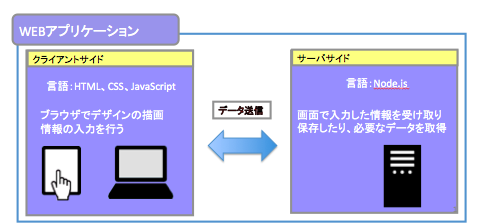
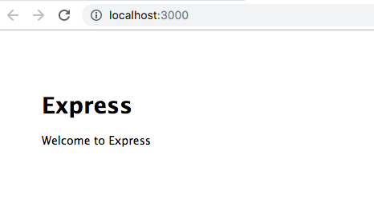

# Javascriptで0から始めるWEBアプリ

## WEBアプリとは
インターネットから利用するアプリケーションソフトウェア

### WEBアプリの構成
WEBアプリはクライアントサイド（フロントエンド）とサーバーサイド（バックエンド）の構成でできています。  
クライアントサイドではブラウザでデザインの描画を主に担当し言語はHTML、CSS、JavaScriptを使用して画面を作成します。  
対するサーバーサイドはユーザが画面で入力した情報を受け取り保存したり、必要なデータを取得する役割を担います。

 

### 使用するサーバーサイドの言語はNode.js
Node.jsは上記のWEBアプリのサーバサイドで使用するJavaScript言語です。  
サーバーサイドで使用できる言語は他にはJava、PHP、Ruby、Pythonなどがあります。

### Node.jsが他のサーバーサイドの言語より優れている点
・クライアントサイドのJavaScriptとほぼ言語の記述が同じなので、WEBアプリを実装する上で習得コストが低い  
・リアルタイムWebと言われるリアルタイムの反応が必要なWebアプリの構築が容易  
　（例：LINE、Twitter、slackなどのチャット機能）

### WEBアプリを作成するための準備ステップ
WEBアプリを作成するためには以下の順序で始めていきます。  
①ソースコードエディタを用意する。  
②Node.jsをインストールする。  
③フレームワーク(Express)を構築してWEBアプリの雛形を作る。   
④WEBアプリを起動する。  

#### ①ソースコードエディタを用意する
プログラミングをするにはエディタを使用して進めていきます。(メモ帳、サクラエディタなど)   
ここではお勧めのVS Code(Visual Studio Code)を使用します。  

以下よりセットアップしましょう。  
[VS Code インストール](./install-vscode-learning.md)

#### ②Node.jsをインストールする。

次に今回サーバーの役割を担うNode.jsをセットアップします。  
[Node.js インストール](./install-node-learning.md)

#### ③フレームワーク(Express)を構築してWEBアプリの雛形を作る。  

今度はWEBアプリの基礎を作成します。  
[フレームワーク(Express)の構築](./install-express-learning.md)

#### ④WEBアプリを起動する。    
```
windows
$ SET DEBUG=learning:* & npm start
Mac
$ DEBUG=learning:* npm start
```
WEBアプリへアクセス  
http://localhost:3000/  

 

上と同じ画面が表示されれば構築成功です！WEBアプリの環境の構築が完了しました。  

## チャットを作ろう
ここからはWEBアプリの中身をプログラミングしてきます。  

[Node.js チャットを作ろう](./contents-chat-learning.md)

## 画面のデザインをしよう
最後に画面のデザインをしていきましょう。  

[CSSで画面のデザインをしよう](./contents-css-learning.md)
 

 
