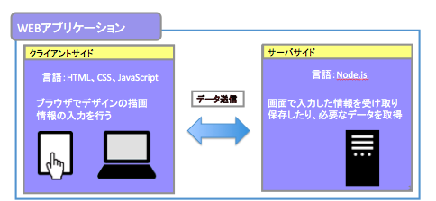
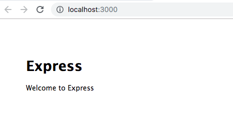

# Javascriptで0から始めるWEBアプリ

## WEBアプリとは
インターネットから利用するアプリケーションソフトウェアです。  
企業のホームページや飲食店、旅行の予約といったことができるサイトはWEBアプリになります。  

### WEBアプリの構成をみていきましょう
WEBアプリはクライアントサイド（フロントエンド）とサーバーサイド（バックエンド）の構成が基本です。    
クライアントサイドではブラウザ(Chrome、IEなど)に表示するデザインの描画等を主に担当し  
「`HTML、CSS、JavaScript'」の技術を使用して画面を作成していきます。  
対するサーバーサイドはユーザが画面で入力した情報を受け取りデータベースに保存したり、データを  
ファイルから取得して返却するなど、ユーザが起こした検索や登録といったアクションに応じた処理を行います。

 

### クライアントサイドを作る上で必要な技術
まずは、クライアントサイドを構成する上で必要な技術を説明します。
#### HTML
Webページを作るための基本的な言語。WEBページにある文字やレイアウトの表示は  
HTMLを使用して作られています。下記のようなあらかじめ用意されたタグを配置し  
WEBページを構成していきます。  
（例）`「<p>こんにちわ！</p>」「<input type="submit" value="送信">」`

#### CSS
CSSとはスタイルシートとも呼ばれデザインや見栄えを整える言語。  
画面のデザインをカラフルにしたい、アニメーションでスマートな画面に  
したい場合に必要な技術になります。  
（例）`「p {color : blue ;}」`

#### JavaScript
画面で高度なアクションをする際に使用するプログラミング言語。  
Webページは基本的にはHTMLだけでも動作しますが、クリックして画像を切り替えるなど    
快適な画面にするにはJavaScriptの技術が必要になります。  
（例）`「alert("thank you!");}」`

### サーバーサイドを作る上で必要な技術
次に、サーバーサイドを構成する上で必要な技術を説明します。  
サーバーサイドで使用できる言語は一般的にはNode.js、Java、PHP、Ruby、Pythonなどがあります。  
この中で一番使われている言語はJavaで、仕事で使用しているエンジニアの数も多いです。

#### 今回使用する言語はNode.js
Node.jsはサーバサイドで使用するJavaScriptをベースとした言語です。  
Node.jsを今回採用している理由は、他のサーバーサイドの言語より以下が優れているからです。    
・クライアントサイドのJavaScriptと言語の記述が同じで、WEBアプリを実装する上で習得コストが低い   
・リアルタイムWebと言われるリアルタイムの反応が必要なWebアプリの構築が容易  
（例）`LINE、Twitter、slackなどのチャット機能」`

### WEBアプリを作成するための準備ステップ
構成を学んだ後はアプリ作成までのステップを学びましょう。  
以下の順序で進めていきます。  
①`ソースコードエディタを用意する。`  
②`Node.jsをインストールする。`  
③`フレームワーク(Express)を構築してWEBアプリの雛形を作る。`   
④`WEBアプリを起動する。`  

#### ①ソースコードエディタを用意する
プログラミングをするにはエディタを使用して進めていきます。  
（例）`メモ帳、サクラエディタなど」`  ここではお勧めのVS Code(Visual Studio Code)を使用します。  

以下よりセットアップしましょう。  
[VS Code インストール](./install-vscode-learning.md)

#### ②Node.jsをインストールする。

次に今回サーバーの役割を担うNode.jsをセットアップします。  
[Node.js インストール](./install-node-learning.md)

#### ③フレームワーク(Express)を構築してWEBアプリの雛形を作る。  

今度はWEBアプリの基礎を作成します。  
[フレームワーク(Express)の構築](./install-express-learning.md)

#### ④WEBアプリを起動する。    
起動はOSによって多少異なります。  
```
windows
$ SET DEBUG=learning:* & npm start
Mac
$ DEBUG=learning:* npm start
```
起動したら以下のURLよりアプリへアクセスします。    
http://localhost:3000/  

 

上と同じ画面が表示されれば構築成功です！WEBアプリの環境の構築が完了しました。  

## チャットを作ろう
ここからはWEBアプリの中身をプログラミングしてきます。  

[Node.js チャットを作ろう](./contents-chat-learning.md)

## 画面のデザインをしよう
最後に画面のデザインをしていきましょう。  

[CSSで画面のデザインをしよう](./contents-css-learning.md)
 

 
