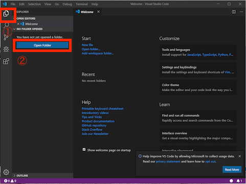
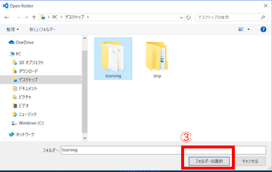
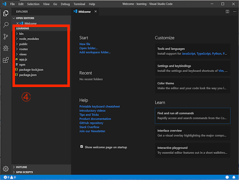
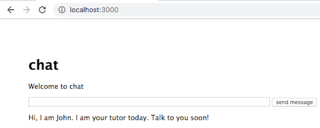
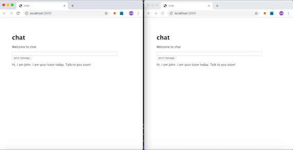
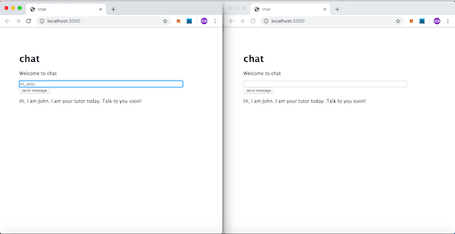
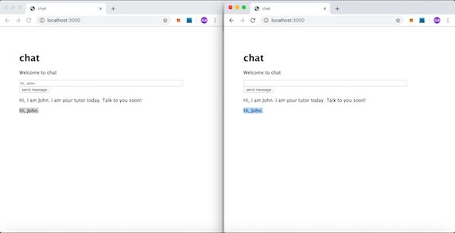

## チャットを作ろう
ここからはWEBアプリのファイルを追加・修正しプログラミングしていきましょう。  

---
### ①リアルタイムWeb機能を実装
［Ctrl］＋［C］ WEBアプリのバッチジョブは停止し、リアルタイムWeb機能のモジュールを追加します。  
```
$ npm i -S socket.io
```

#### npm
npmとはNode Package Managerの略でNode.jsのライブラリやパッケージを
管理する為のツールです。  
上記はコマンドは`npm install --save socket.io`の短縮で  
インストールとセーブをnpmの後ろに指定することで様々な機能を簡単に追加できます。

---
### ②VSCdodeにサーバーディレクトリを読み込む

次に「learning」を読み込み、VSCdodeで修正できるようにします。 
手順は以下の通り行います。   
1. 「Explorer」を選択する  
2. 「Open Folder」ボタンを押す  
   

3. 「learning」フォルダを選択する  
   

4. 「learning」フォルダの中身が表示される  
   

---
### ③修正ファイルの役割
今は「Welcome to Express」と表示されている画面を以下のファイルを修正して行くことで  
チャットへと変身させていきます。  
対象のファイルです。  
・views/index.ejs  
・route/index.js  
・bin/www

#### ejsファイル
ejsは (Embedded JavaScript templates)の略です。  
テンプレートエンジンと言われているファイルでexpressの環境を    
構築した時に以下のコマンドで使えるようにしています。  
`express --view=ejs`  
クライアントサイドのhtmlファイルと同等の役割があり、サーバーサイドから  
このファイルに対して動的な値を渡すことができるようになります。  
(例)`<h1><%= title %></h1>`と記述しておくと   
サーバーで以下のように`title`に`Express`文字を設定すると    
```
res.render('index', { title: 'Express' });
```
画面に描画される時に`title`は`Express`という文字に変換されます。    

#### jsファイル
サーバーサイドの処理を担うファイルです。  

#### wwwファイル
サーバーを起動させたり、環境設定をしたりアプリケーションの根幹を担うファイルです。  

---
### ④ファイルの修正を行う
ここからはプログラミングになります。まずはアプリを構築していく全体の流れを掴む為に  
内容に沿ってコーディングしていきましょう。

#### views/index.ejsを修正
変更前
```
<!DOCTYPE html>
<html>
  <head>
    <title><%= title %></title>
    <link rel='stylesheet' href='/stylesheets/style.css' />
  </head>
  <body>
    <h1><%= title %></h1>
    <p>Welcome to <%= title %></p>
  </body>
</html>
```
↓
変更後
```
<!DOCTYPE html>
<html>
  <head>
    <title><%= title %></title>
    <link rel='stylesheet' href='/stylesheets/style.css' />
  </head>
  <body>
    <h1><%= title %></h1>
    <p>Welcome to <%= title %></p>
    <!-- 追加 start-->
    <input type="text" id="message" size="80" maxlength="100">
    <button>send message</button>
    <div>
        <p>Hi, I am John. I am your tutor today. Talk to you soon!</p>
    </div>
    <script src="https://code.jquery.com/jquery.min.js"></script>
    <script src="/socket.io/socket.io.js"></script>
    <script>
    var socket = io.connect();
    $('button').on('click', function() {
      var text = $('#message').val();
      $('div').append('<p>' + text + '</p>'); 
      socket.emit('request', text);
    });
    socket.on('response', function(param) {
      $('div').append('<p>' + param + '</p>'); 
    });
    </script>
    <!-- 追加 end-->
  </body>
</html>
```

#### route/index.jsを修正
変更前
```
var express = require('express');
var router = express.Router();

/* GET home page. */
router.get('/', function(req, res, next) {
  res.render('index', { title: 'Express' });
});

module.exports = router;
```
↓
変更後
```
var express = require('express');
var router = express.Router();

/* GET home page. */
router.get('/', function(req, res, next) {
  // 修正 start
  res.render('index', { title: 'chat' });
  // 修正 end
});

module.exports = router;
```

#### bin/wwwを修正
変更前
```
/**
 * Listen on provided port, on all network interfaces.
 */

server.listen(port);
server.on('error', onError);
server.on('listening', onListening);
```
↓
変更後
```
/**
 * Listen on provided port, on all network interfaces.
 */

server.listen(port);
server.on('error', onError);
server.on('listening', onListening);

// 追加 start
var socketIO = require('socket.io');
var io = socketIO.listen(server);
io.on('connection', function(socket) {
  socket.on('request', function(param) {
    socket.broadcast.emit('response', param);
  });
});
// 追加 end
```

修正を反映するためにWEBサーバーの再起動をします。  
サーバーサイドのファイル(*.js、www)を修正した場合は必ず再起動をしてください。
```
［Ctrl］＋［C］
$ SET DEBUG=learning:* & npm start
```
WEBアプリへアクセスし以下の画面が表示すればコーディング成功です。  

 
  
---
### ⑤アプリでリアルタイム通信をしてみる
手順は以下の通り  
1.ブラウザを画面に並列に配置する  

 

2.片方のテキストに「Hi, John.」と入力し「send message」ボタンを押す
 

3.両方のブラウザにメッセージが表示される。 
 

---
### 演習チャレンジ
*** アドレスバーのlocalhostをIPアドレスに変更しスマホや他のPCからお互いに通信できるのでやって見ましょう。 ***

---
 