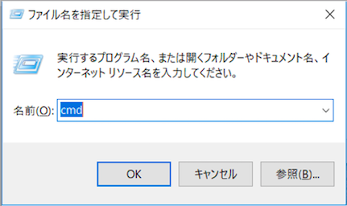
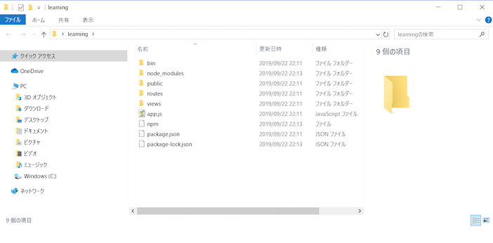

### ExpressでWEBアプリの雛形を作る
Expressは、WEBアプリの構成を簡単に用意できるNode.jsのフレームワークです。

#### コマンドプロンプトを立ち上げます  
［Windows］＋［R］ を押しファイル名を指定して実行よりコマンドプロンプトを立ち上げます。




#### Expressを構築  
カレントディレクトリをデスクトップに移動します。
そこで以下のコマンドを順番に実行します。
```
$ mkdir learning
$ cd learning
$ npm i -g express-generator
$ express --view=ejs
$ npm i
```

以下のように「learning」のフォルダにファイルが作成されていれば成功です。

  