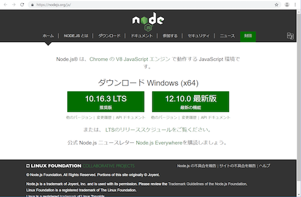
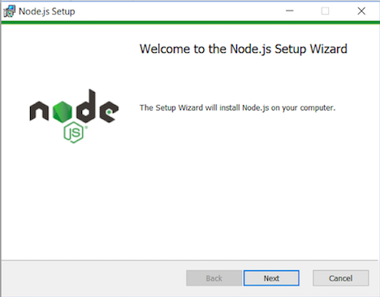
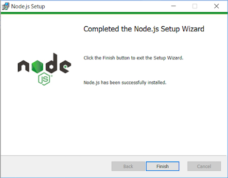

### Node.jsのインストール
Node.jsを使用するにはインストールが必要です。

#### ①Node.jsのサイトへアクセスし推奨版をダウンロード  
https://nodejs.org/ja/



#### ②「node-v10.16.3.msi」を実行しインストール  
特に設定は変えず道なりに進める  


インストールが終わると以下の画面となる  


#### ③インストールの確認方法
以下のコマンドを入力し確認する  
```
$ node -v
v10.16.3
$ bpm -v
6.9.0
```
  