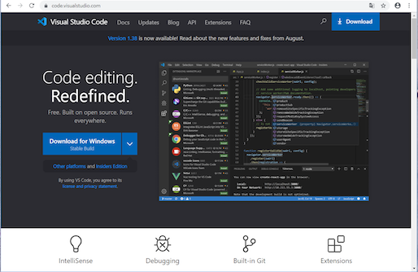
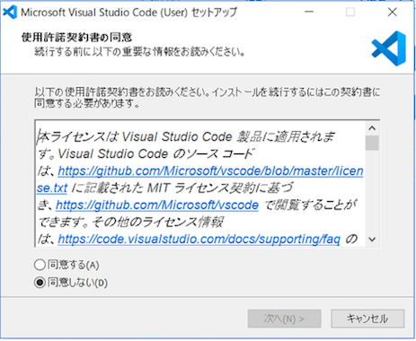
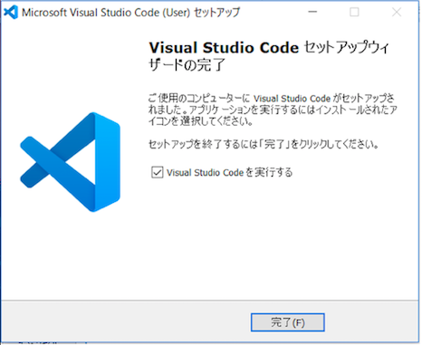

### VS Codeのインストール
プログラミングを効率よく行うためエディタを使用します。

#### ①VS Codeのサイトへアクセスしダウンロード  
https://code.visualstudio.com/

#### ②「VSCodeUserSetup-x64-1.38.1.exe」を実行しインストール  
特に設定は変えず道なりに進める  

インストールが終わると以下の画面となる  

  